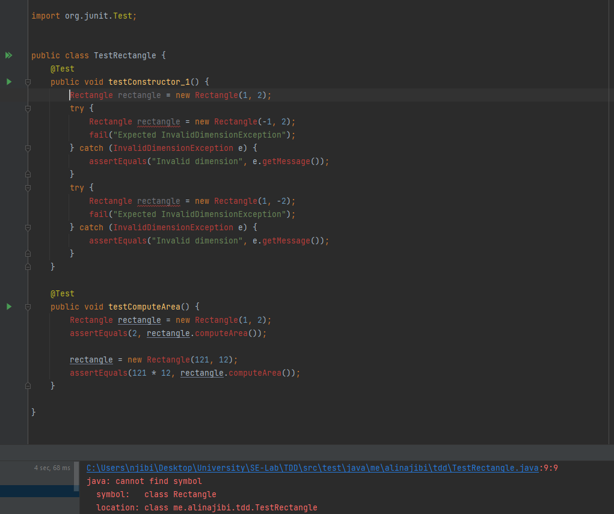
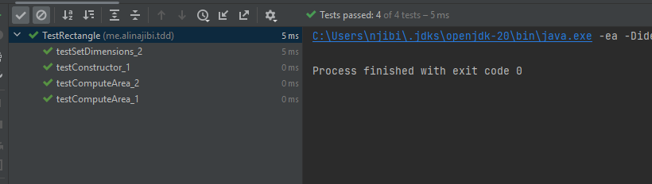
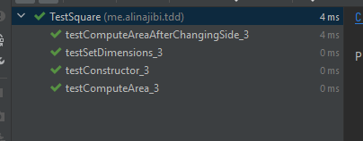

# 
Sharif University of Technology Department of Computer Engineering Software Engineering Lab

## Students Info:

### Ali Najibi, 98106123  Alireza Honarvar, 98102551

## General Info:
In this project, we want to explore different principles of Object-Oriented Programming along with 
the Test Driven Development approach. We will use the Java programming language and the JUnit framework
for writing our test cases.

## Experiment:

### Requirement 1:
As indicated in the instructions, we need to create a program capable of computing 
the area of a rectangle. To achieve that, we first need to write respective test cases
for the program. Test cases regarding this requirement are indicated with a trailing `1` at the end
of the name of the test function.

Now, we will compile the program and run the test cases. The result will be the following 
compile errors:

We will resolve these compile errors and run the test cases again.
#### Explanation about these two test cases:
- The first test case testConstructor will test to make sure the constructor of the Rectangle class
  is working correctly. To do that, we create a new instance of the Rectangle class and check to see
  if the width and height of the rectangle can be of invalid dimensions (negative).
- The second method makes sure that the `computeArea` method works properly.

After resolving the compile errors, we will run the test cases again. This time, the result will be
the following:

As you can see from the above, all tests have been passed successfully.

### Requirement 2:
Now, we will add a new requirement to the program. We want to be able to change the width and height
of the rectangle, we first write the test for these requirements. Test cases related to this requirement
are indicated with a trailing `2`.
#### Explanation about these two test cases:
- The first test case makes sure that the `setWidth` and `setHeight` methods work properly. These
methods should throw `InvalidDimensionException` if the width or height is negative.
- The second test case makes sure that the `computeArea` method works properly after changing either 
the `width` or the `height` of the rectangle.
We will repeat the same process as before and resolve the compile errors. After resolving the compile erros, we will resolve
the runtime errors which are none in this case.

you can see the result of running these test leading to success in the following image:

Now, we need to do some refactoring in the test cases part since there are some
unused variables and overall, some refactoring is required. You can see these refactorings
in the commit with message `Refactor 1, TestCases`.

### Requirement 3:
Now, we will add the capability to have both rectangle and squire. We will first write respective
test cases for this requirement. Test cases related to this requirement are indicated with a trailing `3`.
Now, we will resolve the compile errors and run the test cases. The result will be the following:

 Now, we need to refactor the square. Since square is a type of rectangle with
equal width and height, we can use the inheritance capability of Java and 
extend the `Rectangle` class to create the `Square` class. You can see the result
of this refactoring in the commit with message `Refactor 2, Square`.