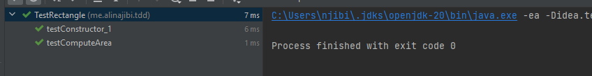

# 
Sharif University of Technology Department of Computer Engineering Software Engineering Lab

## Students Info:

### Ali Najibi, 98106123  Alireza Honarvar, 98102551

## General Info:

In this project, we want to explore different principles of Object-Oriented Programming along with
the Test Driven Development approach. We will use the Java programming language and the JUnit framework
for writing our test cases.

## Experiment:

### Requirement 1:

As indicated in the instructions, we need to create a program capable of computing
the area of a rectangle. To achieve that, we first need to write respective test cases
for the program. Test cases regarding this requirement are indicated with a trailing `1` at the end
of the name of the test function.

Now, we will compile the program and run the test cases. The result will be the following
compile errors:

We will resolve these compile errors and run the test cases again.

#### Explanation about these two test cases:

- The first test case testConstructor will test to make sure the constructor of the Rectangle class
  is working correctly. To do that, we create a new instance of the Rectangle class and check to see
  if the width and height of the rectangle can be of invalid dimensions (negative).
- The second method makes sure that the `computeArea` method works properly.

After resolving the compile errors, we will run the test cases again. This time, the result will be
the following:

As you can see from the above, all tests have been passed successfully.

### Requirement 2:

Now, we will add a new requirement to the program. We want to be able to change the width and height
of the rectangle, we first write the test for these requirements. Test cases related to this requirement
are indicated with a trailing `2`.

#### Explanation about these two test cases:

- The first test case makes sure that the `setWidth` and `setHeight` methods work properly. These
  methods should throw `InvalidDimensionException` if the width or height is negative.
- The second test case makes sure that the `computeArea` method works properly after changing either
  the `width` or the `height` of the rectangle.
  We will repeat the same process as before and resolve the compile errors. After resolving the compile erros, we will
  resolve
  the runtime errors which are none in this case.

you can see the result of running these test leading to success in the following image:

Now, we need to do some refactoring in the test cases part since there are some
unused variables and overall, some refactoring is required. You can see these refactorings
in the commit with message `Refactor 1, TestCases`.

### Requirement 3:

Now, we will add the capability to have both rectangle and squire. We will first write respective
test cases for this requirement. Test cases related to this requirement are indicated with a trailing `3`.
Now, we will resolve the compile errors and run the test cases. The result will be the following:

Now, we need to refactor the square. Since square is a type of rectangle with
equal width and height, we can use the inheritance capability of Java and
extend the `Rectangle` class to create the `Square` class. You can see the result
of this refactoring in the commit with message `Refactor 2, Square`.

## Questions:

### Question 1:

Explain each of the SOLID principles.

- S - `Single Responsibility Principle`: This principle states that an entity (Class, Function, Interface, etc.) should
  have only one reason to change.
  It means that it should have only one responsibility or task to perform.
- O - `Open-Closed Principle`: This principle states that a class should be open for extension but closed for
  modification.
  It means that we should be able to add new functionality to a class without changing its existing code.
  This can be achieved by using abstractions, interfaces, and inheritance.
- L - `Liskov Substitution Principle`: This principle states that any object of a superclass should be able to be
  replaced
  by an object of a subclass without affecting the correctness of the program.
  It means that the behavior of the subclass should be consistent with the behavior of the superclass.
  This can be achieved by using polymorphism and inheritance.
- I - `Interface Segregation Principle`: This principle states that clients should not be forced to depend on interfaces
  they do not use. It means that we should break down interfaces into smaller and more focused ones
  so that clients can implement only the interfaces that they need.
  This helps to reduce coupling and make the code more flexible.
- D - `Dependency Inversion Principle`: This principle states that high-level modules should not depend on
  low-level modules, but both should depend on abstractions.
  It means that we should depend on abstractions rather than concrete implementations.
  This helps to decouple the code and make it more modular and testable.

### Question 2:

At which stages of creating a software  (Requirement analysis, Design, Implementation, Test, Deployment) are the SOLID
principles used?
Solid principles are used in all stages of creating a software; each stage has its own application of these principles:

1. Requirement Analysis:
   During requirement analysis, we can apply the `Single Responsibility` principle to identify and define
   the responsibilities and requirements of different classes, objects, and components.

2. Design:
   During design, we can apply all five SOLID principles to create a flexible, maintainable, and scalable architecture.
   We can use the `Open-Close` and `Liskov Substitution` principles to create abstract classes and interfaces,
   and use them to define contracts and dependencies between different modules.
   We can apply the `Interface Segregation` principle to break down interfaces into smaller, more focused ones,
   and use the `Dependency Inversion` principle to design loosely coupled modules and layers.

3. Implementation:
   During implementation, we can use the SOLID principles to write clean, modular, and testable code.
   In fact, this stage is the most important stage in which we have to stay bound to these principles and
   apply them to the code as much as possible.

4. Test:
   During testing, we can use the SOLID principles to write unit tests and integration tests that verify the behavior
   and
   interactions of different components. We can use the `Single Responsibility` principle to test individual
   classes and methods, and use the `Open-Close` and `Liskov Substitution` principles to write test which are compatible
   with future changes and to test the classes to make sure they obey the `Liskov Substitution` principle.

5. Deployment:
   In the deployment stage, we can profile the performance of the application, find the bottlenecks, find the
   points of failure. We can use the SOLID principles to refactor the code and improve the performance of the
   application accordingly.

### Question 3:

Normally, writing tests is done after writing the code. But in TDD, we write the tests before writing the code.
Do you think these two practices contradict each other?

The fact is that they both try to achieve the same thing, they both try to create a software that satisfy
both functional and non-functional requirements. An example of such seemingly contradictory practices will be
the bottom-up and top-down approaches in designing a Hardware. In the first approach (Develop-Test) we will
write test according to the code we have developed and we might lose test scenarios that we forgot to write proper
code for since the programmers' mind is biased towards the code they have written. In the second approach (Test-Develop)
since the programmer will think about the test cases before writing the code, they will be able to write more
comprehensive test cases. Moreover, usually, writing tests will be neglected if done in the end of the development since
programmers are usually in a false sense of security that their code is working properly and they will not write
respective
test cases.

### Question 4:

What if we didn't need the requirement of changing the width and height of the rectangle?
In this case, we would not need to write the test cases related to this requirement and we would not need to
write the respective code. This would result in a simpler code and less time spent on writing the code and
maintaining it. But, since we have considered the `SOLID` principles, and we have refactored
to eliminate duplicates and to make the code more flexible, we can easily add new requirements to the code if
needed.